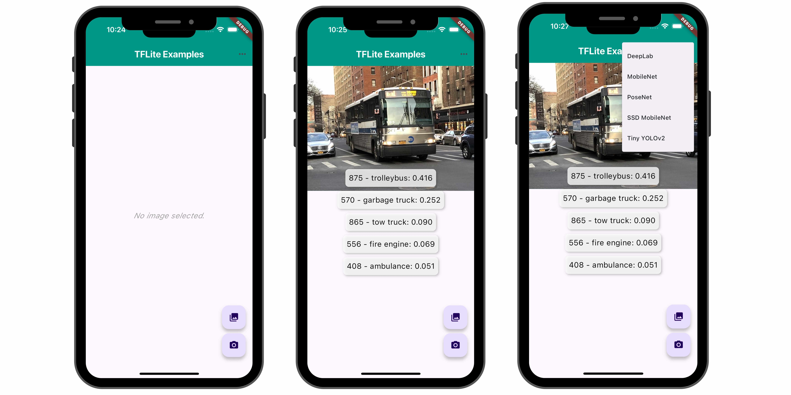
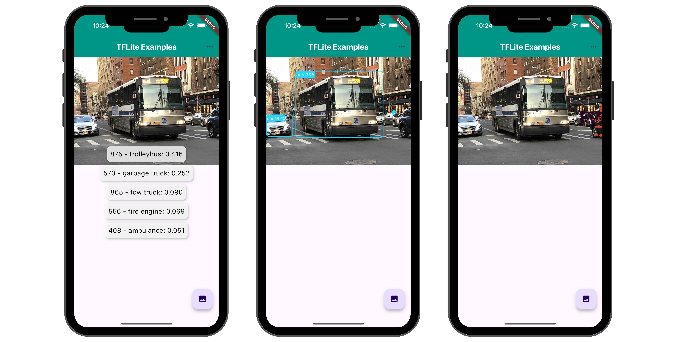

# Tflite Example Application

An example application that shows how to use  Tflite plugin to run model on images. Here images are capture by camera or is selected from gallery.

 

 

## Prerequisites

The `assets` folder contains various models tflite file.

 - mobilenet_v1_1.0_224.tflite
 - mobilenet_v1_1.0_224.txt
 - ssd_mobilenet.tflite
 - ssd_mobilenet.txt
 - yolov2_tiny.tflite
 - yolov2_tiny.txt
 - deeplabv3_257_mv_gpu.tflite
 - deeplabv3_257_mv_gpu.txt
 - posenet_mv1_075_float_from_checkpoints.tflite

## Install 

```
flutter packages get
```

## Run

```
flutter run
```
